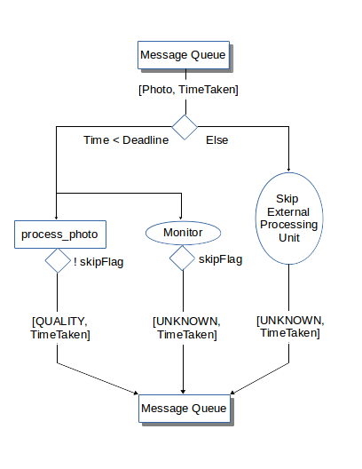

##1. Did the CA1 design document provide you a clear understanding of the intended design? Would you be able to implement the system based on the design document? (It may be worth attempting implementation to properly answer this question, although you are not required to submit any code that you attempt).

Lukas's design document provided sufficient details which made clear the intended design of real-time apple processing system. The main diagram did an excellent job separating out the three threads of processing. The flow of data was a particular strong point, showing the structure of data (any developer could clearly interpret the structure needed to support the data flowing through the messaging queues) and how the data would move (using domain-specific terminology like messaging queues makes the expectations on implementation clear as well).  In addition, the accompanying paragraphs in the report were concise without loss of logical clarity; they explained the crucial logic related to timing for the three main processes.

I will say, however, that additional design diagrams would have made the process easier for a potential developer to implement this system.  The crux of the system design was not detailed in diagrammatic form, which might have led improper interpretation of the design during implementation.

##2. What are the advantages and disadvantages of the CA1 design adopted? How did it differ from your own CA1 design. What improvements would you suggest to the CA1 design, if any?

The design proposed by Lukas is quite similar to mine;  this may be related to the fact that we collaborated on CA1. The use of three threads/processes, as well as message queues to communicate between them, was the core similarity. The way Lukas's design handles the logic of discarding apples after 5 seconds have passed is different.  His design states that he discards apples that have not been processed after 5 seconds.  In contrast, my design has no mechanism by which apples which are still being processed can be discarded.  Subsequent apples which have been blocked by previous apple processing are moved to the quality message queue immediately, marking them as UNKNOWN, and the actuator discards these UNKNOWN apples.

##3. Was the CA1 implementation in accordance with the design?

Lukas's CA1 implementation slightly differed to the proposed design.  The detail in his design about discarding apples that have taken longer than 5 seconds to be processed does not get fully implemented!  To his implementation's defense, the structure of three threads, two message queues in between, and most of the timing logic located in the actuator thread follows closely to the design diagram.  The discrepancy may be due to the fact that the diagram, as is, does not satisfy the design intention of discarding apples that are still being processed by the `process_photo` function after 5 seconds have elapsed.  The "Process Photo" process in the Data Flow Diagram can be expanded, as explained above; if this expansion includes a way for apples to be sent to the actuator prior to the External Processing Unit (`process_photo` method) returning, the original design intention, of throwing away all apples if their quality has not been determined in the deadline, could be satisfied.

##4. Were there any notable features or shortcomings that you noticed in the CA1 implementation? What improvements would you suggest to the CA1 implementation, if any?

##5. Try running the CA1 code provided by your peer under different test conditions. Document your findings in the report:
No stress test on a 4 cpu system

    -- TEST RESULTS --
    Elapsed time (minutes): 5.09
    Number of apples: 300
    Number of bad apples discarded: 18
    Number of good apples discarded: 22
    Number of bad apples packed: 11
    Number of apples spoilt due to bad apples: 105
    Revenue from sale of good apples: $144
    Revenue loss due to system shortcomings: $127 (47%)

Using the command `stress --cpu 1` on a 4 cpu system

    -- TEST RESULTS --
    Elapsed time (minutes): 5.09
    Number of apples: 300
    Number of bad apples discarded: 29
    Number of good apples discarded: 3
    Number of bad apples packed: 3
    Number of apples spoilt due to bad apples: 45
    Revenue from sale of good apples: $220
    Revenue loss due to system shortcomings: $48 (18%)

Using the command `stress --cpu 4` on a 4 cpu system

    -- TEST RESULTS --
    Elapsed time (minutes): 5.10
    Number of apples: 300
    Number of bad apples discarded: 24
    Number of good apples discarded: 15
    Number of bad apples packed: 2
    Number of apples spoilt due to bad apples: 22
    Revenue from sale of good apples: $237
    Revenue loss due to system shortcomings: $37 (14%)

##6. Summarize the performance of the CA1 code under different conditions (document the relevant conditions). Can you explain your the observed variability in performance in terms of the design or implementation decisions? Do you think there is scope for improvement in performance? In case you test any of your recommended changes to the design/code, you may wish to include code snippets and performance improvement details in an appendix to your report (appendix does not count towards the page limit). This is optional, but encouraged, as it will allow you to test your ideas, and enhance your learning experience.

